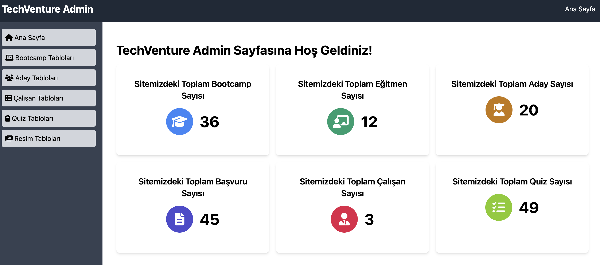
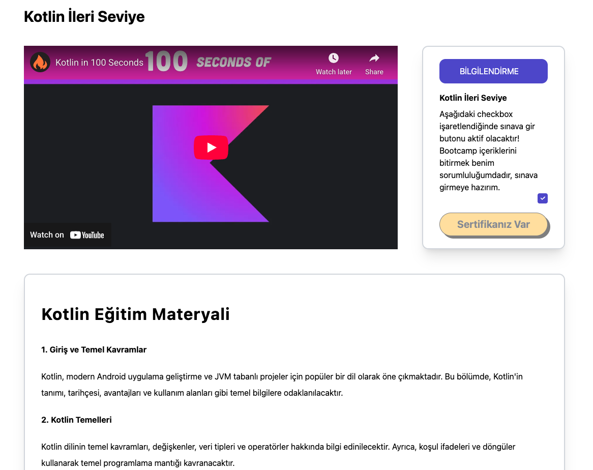
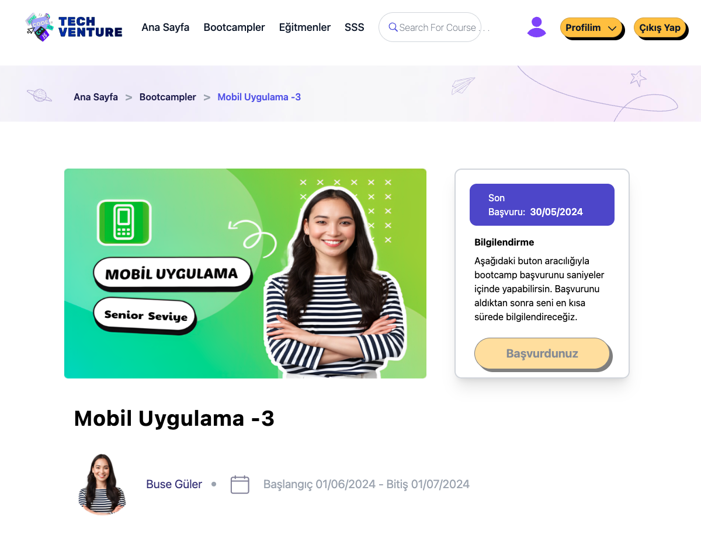
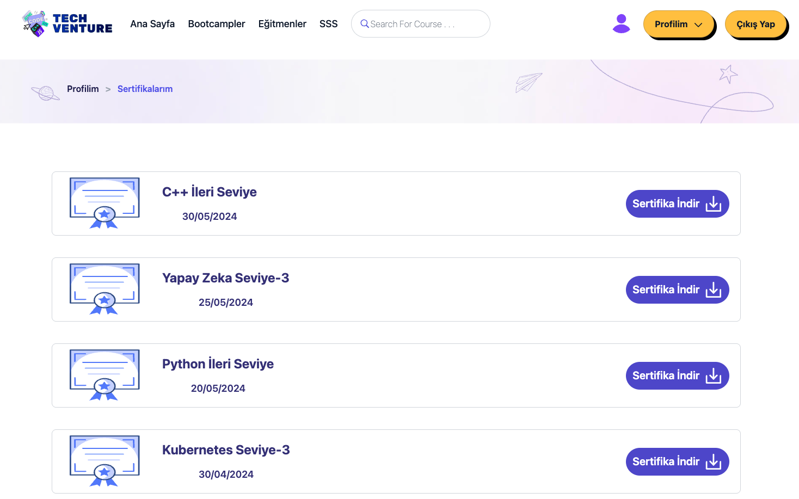
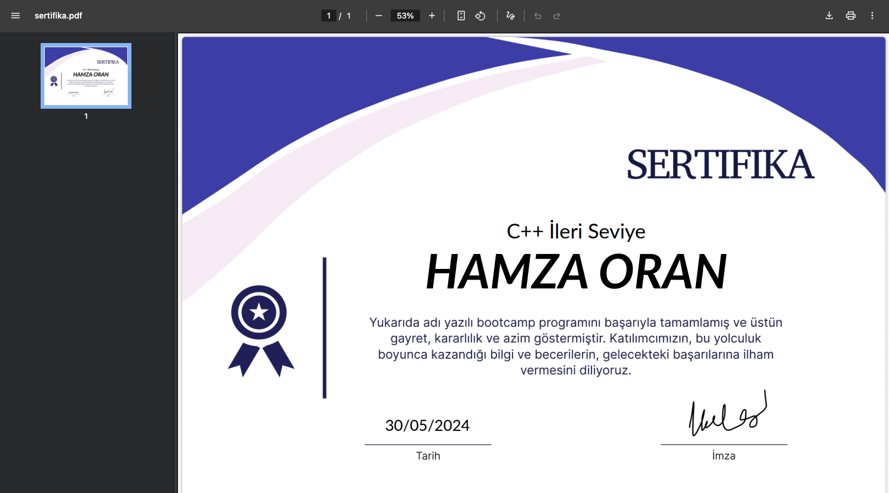
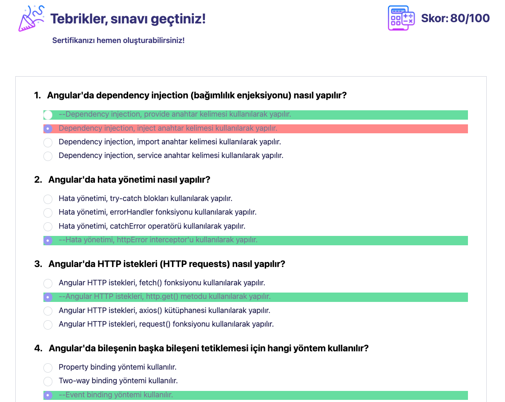
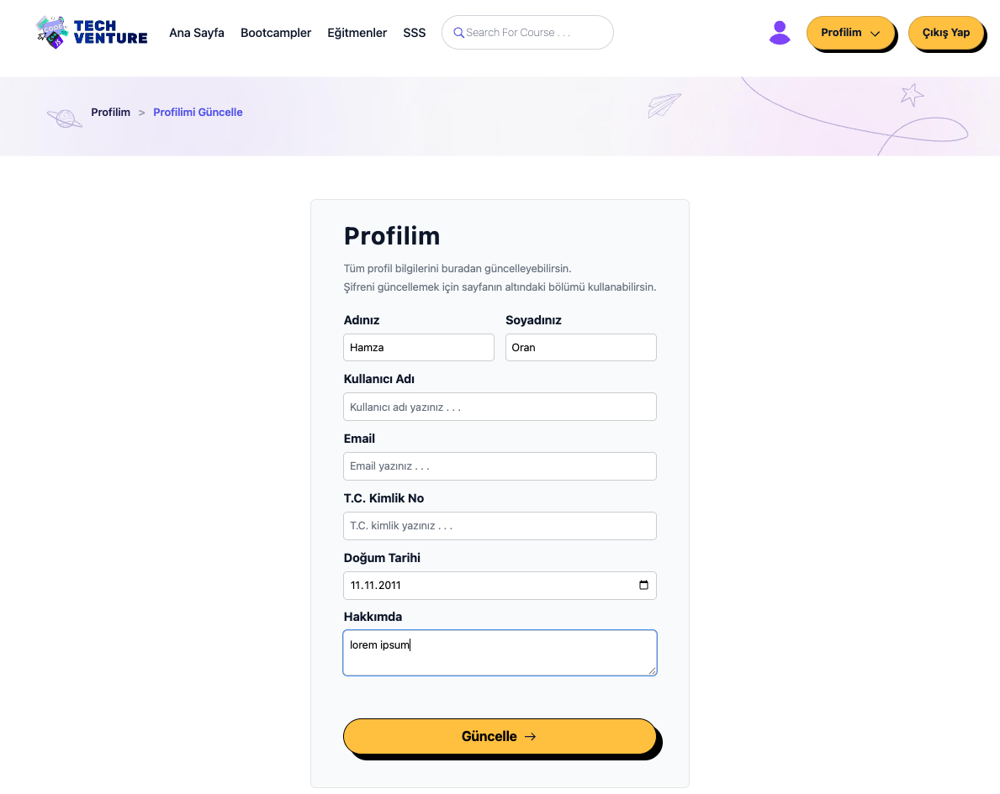

# TechVenture Bootcamp Project

This repository contains the frontend of the project.
Backend repository: [TechVenture-Backend](https://github.com/gulsum-oran-gunes/TechVenture-Backend)

This project is an Angular 17 bootcamp platform frontend. The application is built as a modern, responsive single‑page experience with a clean UI and mobile‑first layout. It delivers multiple pages such as login/register flows, bootcamp listings and details, admin panel workflows, and user operations, all within a fast SPA (Single Page Application) architecture optimized for smooth navigation and consistent UX.

## Live Demo

- App: [TechVenture](https://techventure-web.vercel.app)

## User-Facing Features

- Bootcamp content area for enrolled students (`/bootcampContent`, `/bootcampContentByBootcampId/:bootcampId`)
- Quiz/exam flow for students (`/quiz`, `/quiz/:quizId`)
- Profile update and password change screens (`/updateMyProfile`, `/updatePassword`)
- My bootcamps and certificates pages (`/mybootcamps`, `/mycertificates`)

## Admin and Discovery Features

- Admin panel supports full CRUD operations across management screens (`/admin`)
- Homepage includes a search bar for quick discovery
- Bootcamps listing supports filtering and sorting (`/bootcamps`)

## Technology Stack

- Language: TypeScript
- Framework: Angular 17 (standalone bootstrapping)
- State/Async: RxJS
- UI/CSS: Tailwind CSS + Flowbite (primary), Bootstrap 5 (limited use), Angular Material, PrimeNG
- Design: UI mockups and wireframes prepared in Figma
- Notifications/Alerts: ngx-toastr, SweetAlert2
- Editor: TinyMCE (Angular wrapper + core)
- Icons: FontAwesome
- Auth/JWT: @auth0/angular-jwt (token parsing/handling)
- Build/Tooling: Angular CLI, PostCSS, Autoprefixer
- Test: Karma + Jasmine

## Packages (Summary)

Key dependencies used in the project:

- `@angular/*`: Router, Forms, HttpClient, Animations, Material, and core Angular packages
- `@auth0/angular-jwt`: JWT token utilities
- `ngx-toastr`, `@sweetalert2/ngx-sweetalert2`: Notifications and alert dialogs
- `@tinymce/tinymce-angular`, `tinymce`: Rich text editor
- `bootstrap`, `flowbite`, `primeng`, `@angular/material`: UI component and styling libraries
- `@fortawesome/fontawesome-free`: Icons
- `rxjs`, `zone.js`: Angular reactive and change detection foundations

## Architecture and App Structure

This project uses Angular's standalone setup. The app is bootstrapped via `bootstrapApplication` and providers are configured in `app.config.ts`. Even though `app.module.ts` exists, the app is not bootstrapped from it; it is bootstrapped from `main.ts`.

### Important files

- `src/main.ts`: Application entry point and bootstrap
- `src/app/app.config.ts`: Router, HttpClient, Toastr, and Auth interceptor providers
- `src/app/app.routes.ts`: Route definitions and guards
- `src/environments/*`: `API_URL` definitions
- `build.sh`: Writes `API_URL` into environment files before build

### Routing and Guards

All routes are defined in `app.routes.ts`. Examples:

- `/login`, `/register`
- `/bootcamps`, `/bootcampDetail/:bootcampId`
- `/applications`, `/mybootcamps`, `/mycertificates`
- `/admin` (protected by AdminPanelGuard)
- `/bootcampContent` (protected by LoginGuard)

### Interceptors

There are 3 interceptors under `core/interceptors`:

- `AuthInterceptor`: Adds JWT token and handles refresh token flow (registered in `app.config.ts`)
- `CachingInterceptor`: Simple GET cache (present but not registered)
- `LoggingInterceptor`: HTTP logging (present but not registered)

### Service Layer

Services are separated into abstract and concrete layers under `features/services`:

- `abstracts/`: Interfaces/abstract service definitions
- `concretes/`: Concrete HTTP services (API calls)
- `ui/`: UI focused services (e.g. toaster)

### Models

`features/models` keeps request/response models grouped by domain. This keeps the API contract explicit and organized.

## Folder Structure (Summary)

```
src/
  app/
    core/            -> guard, interceptor, helper, shared models
    features/        -> feature components, services, request/response models
    pages/           -> page components (admin and user side)
    shared/          -> shared components and shared module
    app.config.ts    -> provider configuration
    app.routes.ts    -> routing
  assets/            -> images
  environments/      -> API_URL configuration
  styles.css         -> tailwind entry point
  custom-theme.scss  -> Angular Material theme
```

## Styling and Theme

- `styles.css` includes Tailwind `base`, `components`, and `utilities` (primary styling).
- `tailwind.config.js` enables the Flowbite plugin.
- `custom-theme.scss` contains Angular Material theme definitions.
- `angular.json` adds `ngx-toastr` and `fontawesome` CSS globally; Bootstrap CSS/JS are wired for test configuration.

## Environment Variables

`src/environments/environment.ts` and `environment.development.ts` store `API_URL`.

During build, `build.sh` writes the provided `API_URL` into those files:

```
API_URL="http://localhost:5278/api" npm run prod:build
```

## Deployment

- Deployed on Vercel.
- Backend base URL (dev): `http://localhost:5278/api`
- Production backend URL is configured via `API_URL` at build time.

## Development Commands

- `npm install`: Install dependencies
- `npm start`: Dev server (`http://localhost:4200`)
- `npm run build`: Production build
- `npm run prod:build`: Builds with `API_URL` injected by `build.sh`
- `npm test`: Runs unit tests with Karma + Jasmine

## Notes

- The app includes login/register flows and an admin panel.
- Guards and interceptors centralize access control and HTTP request handling.
- Multiple UI libraries are used together (Bootstrap, Tailwind, Angular Material, PrimeNG, Flowbite).

## Screenshots

### Admin Panel


### My Applications


### Bootcamp Content


### Bootcamp Detail


### My Certificates


### Certificate Example


### Quiz Fail


### Quiz Pass


### Update My Profile

